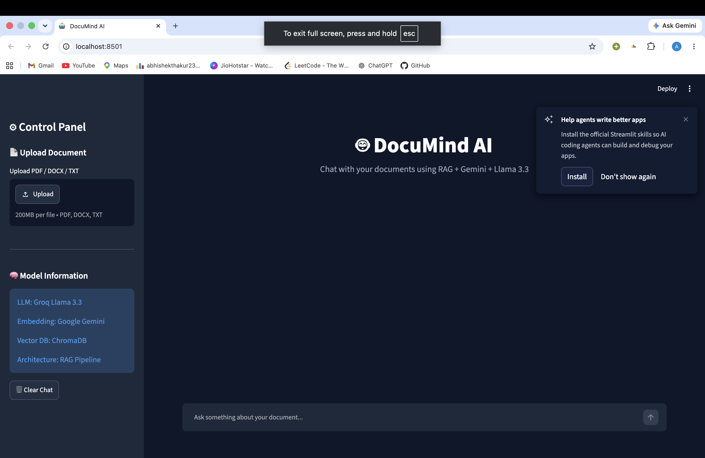
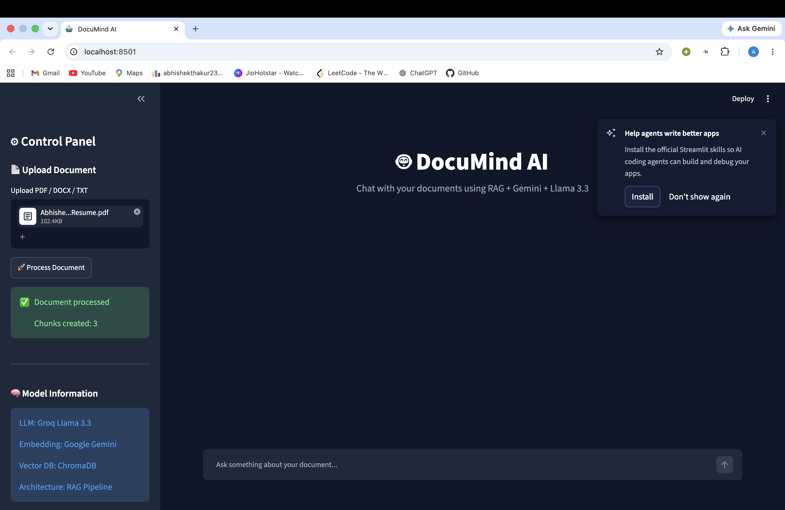
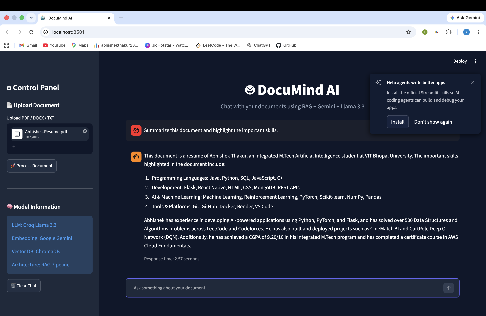

# 🤖 RAG Chatbot - Retrieval Augmented Generation Based Document Assistant

<div align="center">

An AI-powered document question-answering system built using **Retrieval-Augmented Generation (RAG)**, **LangChain**, **ChromaDB**, **Google Gemini Embeddings**, and **Groq Llama 3.3**.

</div>

---

# 👨‍💻 Author

**Abhishek Thakur**

Integrated M.Tech Artificial Intelligence
VIT Bhopal University

---


# 📌 Overview

RAG Chatbot is an intelligent document assistant that allows users to upload documents and ask questions using natural language.

The application uses **Retrieval-Augmented Generation (RAG)** architecture to retrieve relevant information from user documents and provide accurate, context-aware answers using a Large Language Model.

Unlike traditional chatbots that rely only on pre-trained knowledge, this system connects an LLM with a custom knowledge base created from uploaded documents.

---

# ✨ Features

## 📄 Document Intelligence

* Upload PDF, DOCX, and TXT documents
* Extract text from documents
* Split documents into meaningful chunks
* Generate semantic embeddings
* Store embeddings in a vector database

## 🧠 AI Question Answering

* Ask questions from uploaded documents
* Context-aware responses
* Reduced hallucination using retrieval-based generation
* Fast response generation using Llama 3.3

## 🔍 RAG Pipeline

* Document retrieval using semantic similarity
* Vector search using ChromaDB
* Context injection into LLM prompts
* Accurate document-based responses

## 💻 Web Application

* Interactive Streamlit interface
* Chat-based user experience
* Chat history support
* Document upload functionality
* Professional AI assistant interface

---

# 🏗️ System Architecture

```
                  User
                    |
                    |
            Upload Document
                    |
                    ↓
            Document Loader
                    |
                    ↓
            Text Chunking
                    |
                    ↓
          Google Gemini Embeddings
                    |
                    ↓
              ChromaDB
          (Vector Database)
                    |
                    ↓
          Similarity Retrieval
                    |
                    ↓
          Retrieved Context
                    |
                    ↓
           Groq Llama 3.3
                    |
                    ↓
              Final Answer
```

---

# 🛠️ Tech Stack

## Language

* Python

## Frameworks & Libraries

* LangChain
* Streamlit
* ChromaDB
* PyPDF
* Docx2txt

## AI Models

### Embedding Model

* Google Gemini Embeddings

### Large Language Model

* Groq Llama 3.3

## Database

* ChromaDB Vector Database

---

# 📂 Project Structure

```
RAG_Chatbot/

│
├── streamlit_app.py          # Streamlit web application
│
├── rag_engine.py             # RAG pipeline implementation
│
├── ingest.py                 # Document ingestion and vector creation
│
├── document_processor.py     # Upload document processing
│
├── config.py                 # Application configuration
│
├── rag_prompt.py             # Prompt template for LLM
│
├── requirements.txt          # Python dependencies
│
├── .env                      # API keys configuration
│
├── data/                     # Documents
│
└── chroma_db/                # Chroma vector database
```

---

# ⚙️ Installation & Setup

## 1. Clone Repository

```bash
git clone <repository-url>

cd RAG_Chatbot
```

---

## 2. Create Virtual Environment

```bash
python -m venv venv
```

Activate environment:

### macOS/Linux

```bash
source venv/bin/activate
```

### Windows

```bash
venv\Scripts\activate
```

---

## 3. Install Dependencies

```bash
pip install -r requirements.txt
```

---

## 4. Configure API Keys

Create a `.env` file:

```env
GOOGLE_API_KEY=your_google_api_key

GROQ_API_KEY=your_groq_api_key
```

---

## 5. Create Vector Database

Run:

```bash
python ingest.py
```

Output:

```
Chroma database created successfully
```

---

## 6. Run Web Application

Start Streamlit:

```bash
streamlit run streamlit_app.py
```

Open:

```
http://localhost:8501
```

---

# 💬 Example Questions

After uploading a document:

```
Summarize this document.

Explain the main points.

What are the important concepts?

Generate interview questions from this document.

Explain the projects mentioned in this document.
```

---

# 🎯 Applications

* Resume analysis assistant
* Research paper assistant
* Academic document chatbot
* Company knowledge assistant
* Personal AI document assistant
* Document search and question answering

---

# 🔮 Future Enhancements

* Source citation with page numbers
* Multiple document management
* User authentication
* Cloud deployment
* Long-term conversation memory
* Voice-based interaction
* Document history management

# 📸 Screenshots

## Document Upload




## Document Processing




## AI Chat Response




# ⭐ Acknowledgements

Built using:

* LangChain
* Google Gemini
* Groq
* ChromaDB
* Streamlit

---

<div align="center">

⭐ Star this repository if you find it useful.

</div>
